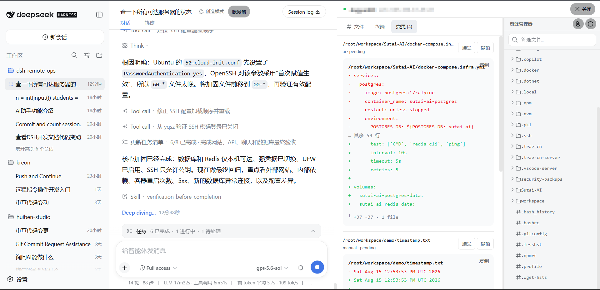

# dsh-remote-ops

`dsh-remote-ops` 是 DeepSeek Harness 的远程主机插件。它为 DSH 增加 SSH 直连、`remote-hostd` 配对、远程命令执行、远程文件读写、任务管理和远程工作台。

插件不会替代 DSH 的本地工具：检查当前本地工作区时，应使用 DSH 自带的本地工具；只有用户明确要求远程、服务器或指定主机操作时，才使用 `host_*` 工具。

## 工作方式

- **SSH 直连**：在 DSH 设置中填写服务器、端口、用户名和首次登录密码。首次连接确认 SSH 指纹后，插件保存本机专用密钥，后续不再保存或使用密码。
- **高级配对**：远端运行 `remote-hostd`，本地输入地址和一次性配对码。适合已经部署 hostd 的机器。
- **远程工作台**：会话标题栏的“服务器”入口用于浏览远程文件、运行远程命令和审阅远程文件变更。

## 界面预览



## 安装

### 从 GitHub 安装（推荐）

安装当前稳定版本：

```bash
dsh plugin --profile web add github:weisiren000/dsh-remote-ops#v0.0.8
```

DSH 会自动把插件安装到 Web profile，并将 `dsh-remote-ops` 注册到 `dsh.profile.bundles`。不需要克隆仓库、手动安装依赖、构建客户端或修改 profile 的 `package.json`。

如果系统没有全局 `dsh` 命令，可以通过 `npx` 执行：

```bash
npx @deepseek-ai/dsh plugin --profile web add github:weisiren000/dsh-remote-ops#v0.0.8
```

安装命令需要本机可以使用 [Git](https://git-scm.com/) 和 pnpm。使用 `npx` 时还需要 Node.js。

### 启动或重启 DSH Web

关闭旧的 DSH Web 进程，然后重新启动：

```bash
dsh web
```

使用 `npx` 的启动方式：

```bash
npx @deepseek-ai/dsh web
```

启动后进入“设置 → 插件 → 远程主机”。看到远程主机面板，说明插件已加载。

### 升级

发布新版本后，重新执行安装命令并替换 TAG：

```bash
dsh plugin --profile web add github:weisiren000/dsh-remote-ops#vX.Y.Z
```

随后重启 DSH Web。

### 卸载

```bash
dsh plugin --profile web remove dsh-remote-ops
```

### 连接远程机器

#### SSH 直连（推荐）

在远程主机面板填写服务器、SSH 端口、用户名和首次登录密码，点击“连接主机”。首次连接显示服务器指纹时，只有确认指纹属于你的服务器才继续。

#### 高级配对

在远端启动 `remote-hostd`，复制终端打印的一次性配对码，然后在面板切换到“高级配对”并填写地址和配对码。

### 验证安装

```powershell
Invoke-WebRequest 'http://127.0.0.1:3080/remote-ops/v1/hosts' | Select-Object StatusCode
```

预期状态码为 `200`。然后在对话中明确说“列出远程主机”或“在指定服务器执行命令”验证 `host_*` 工具；检查本地代码时不要用远程请求作为验证。

## 远端安装 `remote-hostd`

`remote-hostd` 只在使用“高级配对”时需要。它把自己的工作目录作为远程工作区，因此启动前应先切换到要开放的项目目录。

本机回环监听（已有反向代理或只允许本机访问）：

```bash
cd /path/to/remote-project
node /path/to/dsh-remote-ops/src/hostd/cli.js --listen 127.0.0.1:7680
```

直接对局域网或公网提供服务时必须使用 TLS：

```bash
cd /path/to/remote-project
node /path/to/dsh-remote-ops/src/hostd/cli.js \
  --listen 0.0.0.0:7680 \
  --tls-cert /path/to/fullchain.pem \
  --tls-key /path/to/privkey.pem
```

只有在临时隔离网络中，才使用不安全的明文监听：

```bash
node /path/to/dsh-remote-ops/src/hostd/cli.js --listen 0.0.0.0:7680 --allow-insecure
```

终端会打印监听地址和配对码。不要把配对码提交到代码仓库或写入公开日志。

## 模型工具

- `host_pair`：配对一个远程主机。
- `host_list`：列出已配对主机和在线状态。
- `host_use`：切换当前远程目标。
- `host_bash`：在远程主机执行前台或后台命令。
- `host_jobs` / `host_job_log`：查询远程任务和日志。
- `host_list_files` / `host_read_file`：浏览、读取远程文件。
- `host_write_file`：按版本校验写入远程文件并创建待审阅变更。
- `host_review_changes`：查看或处理远程文件变更。

所有远程工具都是显式远程能力。用户没有明确指定远程操作时，Agent 不应调用它们。
